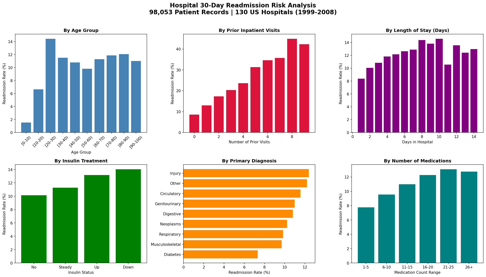

# 🏥 Hospital 30-Day Readmission Risk Analysis

An exploratory data analysis (EDA) of diabetic patient hospital readmissions across 130 US hospitals between 1999 and 2008.

---

## 📌 Project Overview

Hospital readmissions within 30 days are a major quality and cost concern in healthcare. This project analyzes a dataset of **98,053 diabetic patient encounters** to identify key risk factors associated with early readmission.

The analysis surfaces patterns across patient demographics, clinical variables, and treatment details — providing actionable insights for hospital administrators and clinical staff.

---

## 📊 Key Findings

| Factor | Insight |
|---|---|
| **Age** | Patients aged 20–30 have the highest readmission rate (~14.5%) |
| **Prior Inpatient Visits** | Strong predictor — patients with 8+ prior visits reach ~45–50% readmission rate |
| **Insulin Treatment** | Patients with downward insulin adjustments have the highest readmission rate (~14%) |
| **Primary Diagnosis** | Injury and "Other" diagnoses carry the highest readmission risk (~12.5%) |
| **Medications** | Higher medication counts (21–25 range) correlate with higher readmission |
| **Length of Stay** | Longer stays (8–10 days) are associated with elevated readmission rates |

---

## 🗂️ Project Structure
```
hospital-readmission-analysis/
│
├── data/
│   └── diabetic_data.csv          # Raw dataset (98,053 patient records, 50 features)
│
├── notebooks/
│   └── hospital_readmission.ipynb # Full EDA notebook
│
├── images/
│   └── readmission_analysis.png   # Summary visualization (6-panel chart)
│
├── .gitignore
└── README.md
```

---

## 📁 Dataset

- **Source:** UCI Machine Learning Repository — [Diabetes 130-US Hospitals (1999–2008)](https://archive.ics.uci.edu/ml/datasets/diabetes+130-us+hospitals+for+years+1999-2008)
- **Records:** 98,053 patient encounters
- **Features:** 50 columns including demographics, diagnoses, medications, and lab results
- **Target Variable:** `readmitted` — whether a patient was readmitted within 30 days (`<30`), after 30 days (`>30`), or not at all (`NO`)

---

## 🔍 Analysis Performed

- **Data Cleaning:** Handled missing values encoded as `?`, dropped high-missingness columns (`weight`, `A1Cresult`, `max_glu_serum`, `medical_specialty`, `payer_code`)
- **Target Engineering:** Created binary target `readmitted_30` (1 = readmitted within 30 days)
- **Exploratory Analysis:**
  - Readmission rate by age group
  - Readmission rate by number of prior inpatient visits
  - Readmission rate by length of hospital stay
  - Readmission rate by insulin treatment status
  - Readmission rate by primary diagnosis category
  - Readmission rate by number of medications

---

## 📸 Visualization



---

## 🛠️ Tech Stack

- **Python 3**
- **pandas** — data manipulation
- **matplotlib** — plotting
- **seaborn** — statistical visualization
- **Jupyter Notebook**

---

## ▶️ How to Run

1. Clone the repository:
```bash
   git clone https://github.com/heyybaragi/hospital-readmission-analysis.git
   cd hospital-readmission-analysis
```

2. Install dependencies:
```bash
   pip install pandas matplotlib seaborn jupyter
```

3. Launch the notebook:
```bash
   jupyter notebook notebooks/hospital_readmission.ipynb
```

---

## 👤 Author

**Sneha Nannapaneni**  
[GitHub](https://github.com/heyybaragi) · [LinkedIn](https://linkedin.com/in/snehanannapaneni)

---

## 📄 License

This project is open source and available under the [MIT License](LICENSE).
